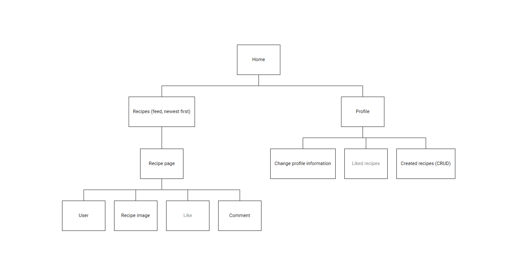
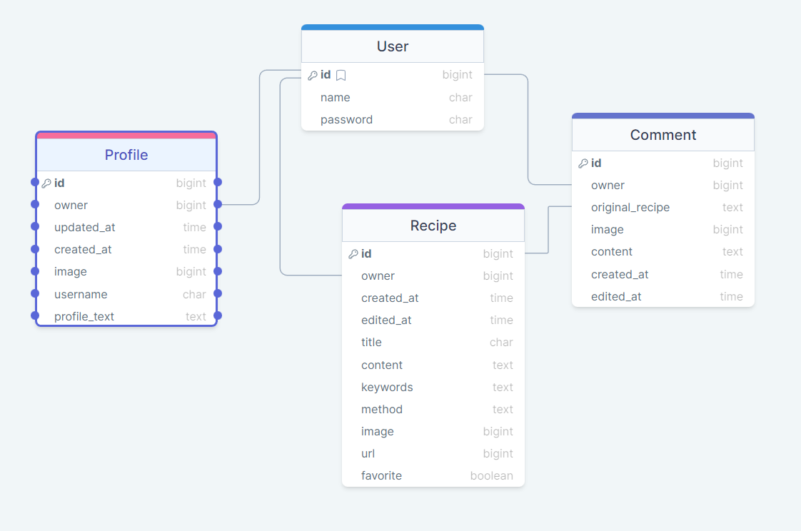
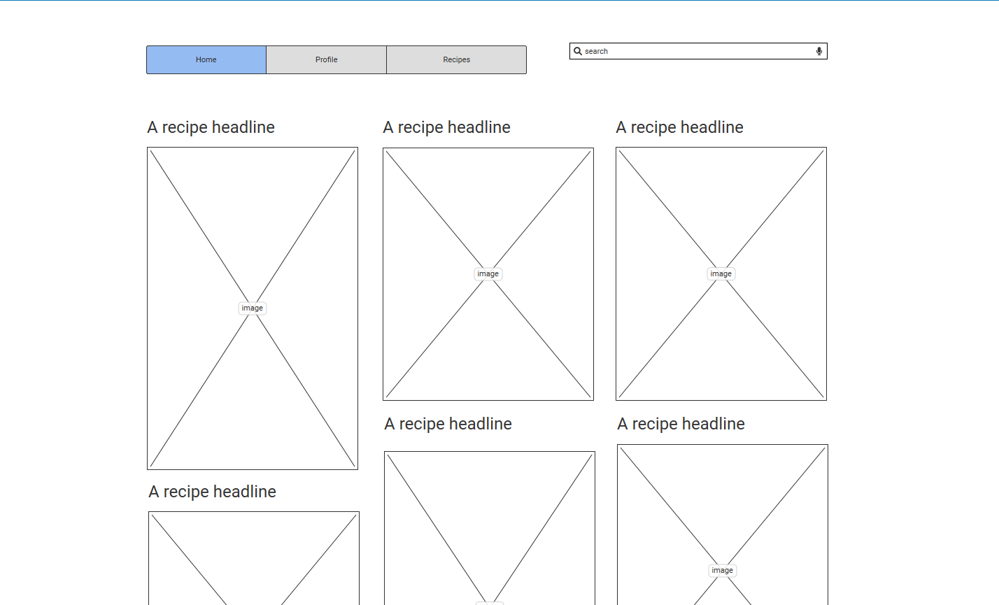
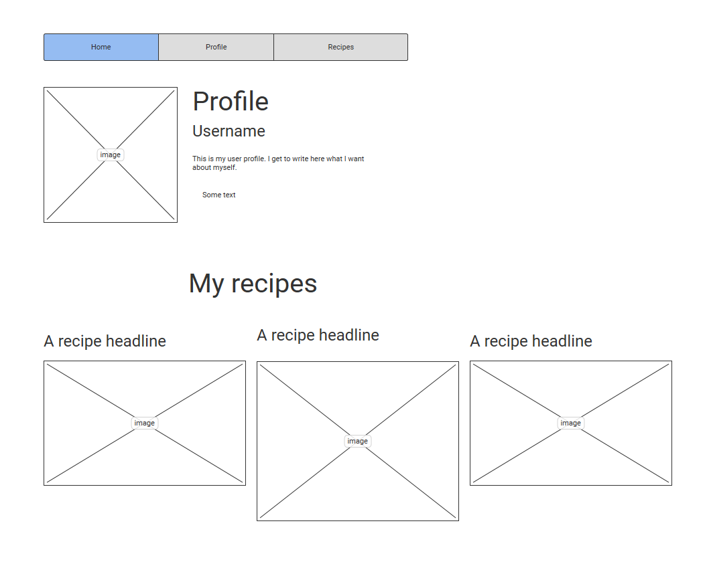
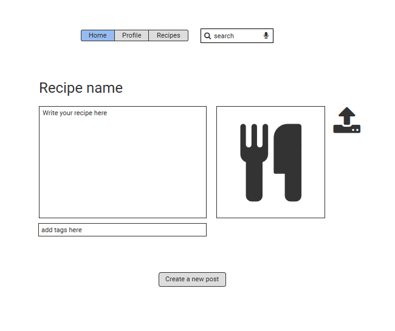
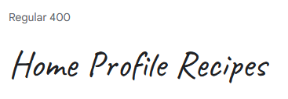

# Potlucky - Your favorite recipe app

Potlucky lets multiple users to save and search recipes online. It's like a communal cookbook!

## Strategy

User can use this app to record a recipe and show it to others. Users can comment on recipes with pictures to show their version of the recipe.

## Scope
### User Stories:
- [All Tasks and User stories](https://github.com/CozyPlantlady/potluck-recipe-app/issues)


If there is time, add *save* function so user can save recipes they like

## Structure

### Site structure


### Data Structure


## Skeleton





## Surface

This app needs to be easy to navigate with crisp colors.

### Fonts
Prosto One


Caveat



## Testing

### User Strory epics:

- [As a User I can create an account so that I can see users-only content](https://github.com/CozyPlantlady/potluck-recipe-app/issues/1)
- [As a User I can sign in so that I get to create, read, edit and delete posts](https://github.com/CozyPlantlady/potluck-recipe-app/issues/2)
- [As a User I can sign out to safely end my session](https://github.com/CozyPlantlady/potluck-recipe-app/issues/3)
- [As a User I can see my profile when logged in so that I get to see my status](https://github.com/CozyPlantlady/potluck-recipe-app/issues/4)
- [As a User I can create a recipe post so that I can share it with others.](https://github.com/CozyPlantlady/potluck-recipe-app/issues/5)
- [As a User I can see recipes posted by others so that I can look through them](https://github.com/CozyPlantlady/potluck-recipe-app/issues/6)
- [As a User I can edit an recipe post so that I can update the information.](https://github.com/CozyPlantlady/potluck-recipe-app/issues/7)
- [As a User I can read a post so that I know it was created.](https://github.com/CozyPlantlady/potluck-recipe-app/issues/8)
- [As a User I can delete a post I made so that I don't have to keep unnecessary posts.](https://github.com/CozyPlantlady/potluck-recipe-app/issues/9)
- [As a User I can comment recipes posted by others so that I can share my thoughts of the recipe.](https://github.com/CozyPlantlady/potluck-recipe-app/issues/10)


#### Testing with Lighthouse


### Bugs and other issues:

[All logged bugs](https://github.com/CozyPlantlady/potluck-recipe-app/issues?q=is%3Aopen+is%3Aissue+label%3ABug)


**ERROR: Failed building wheel for backports.zoneinfo**:
I got this error while deploying to Heroku (This is for the backend part of the project). Found a solution from [Stack Overflow](https://stackoverflow.com/questions/71712258/error-could-not-build-wheels-for-backports-zoneinfo-which-is-required-to-insta), and adjusted my requirements.txt-file accordingly.

**ERROR: Specifying a Node.js Version**:
[Herokus official solution](https://devcenter.heroku.com/articles/nodejs-support#specifying-a-node-js-version)


## CREDITS

Boiler plate code for Sign-up form from Code Institute Moments project.

Fix from Tom_alumnus for the Cors origins problem after deployment to Heroku. This is in drf-api Settings.

```
ALLOWED_HOSTS = [
    os.environ.get("ALLOWED_HOST"),
    "localhost",
]
if "CLIENT_ORIGIN" in os.environ:
    CORS_ALLOWED_ORIGINS = [os.environ.get("CLIENT_ORIGIN")]
if "CLIENT_ORIGIN_DEV" in os.environ:
    extracted_url = re.match(
        r"^.+-", os.environ.get("CLIENT_ORIGIN_DEV", ""), re.IGNORECASE
    ).group(0)
    CORS_ALLOWED_ORIGIN_REGEXES = [
        rf"{extracted_url}(eu|us)\d+\w\.gitpod\.io$",
    ]
```

